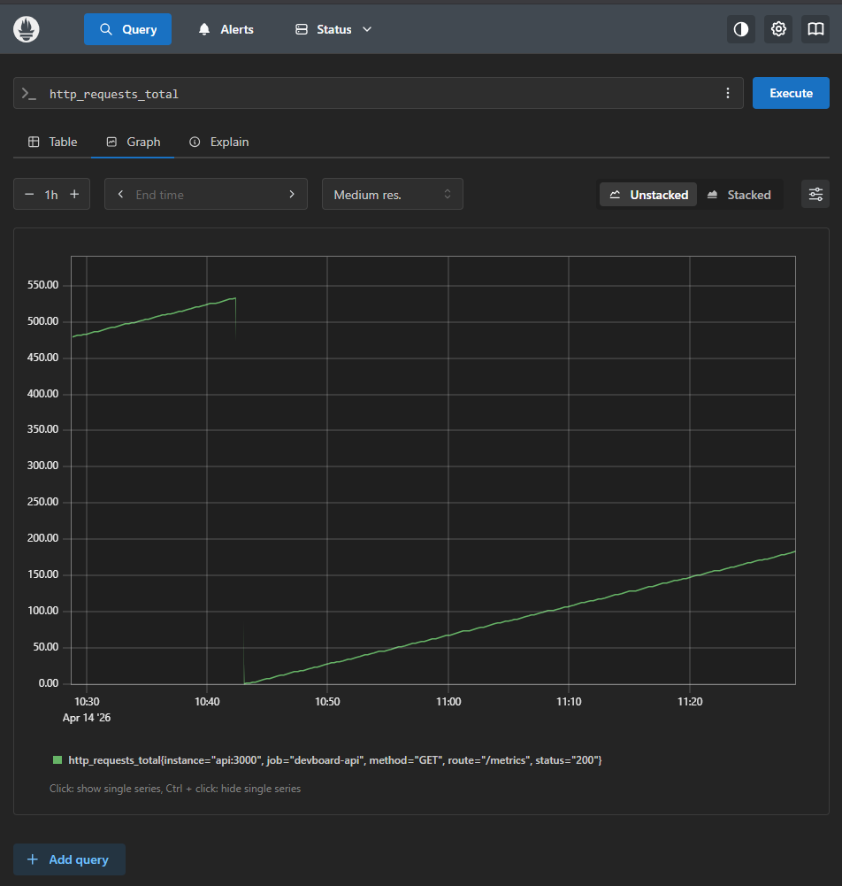
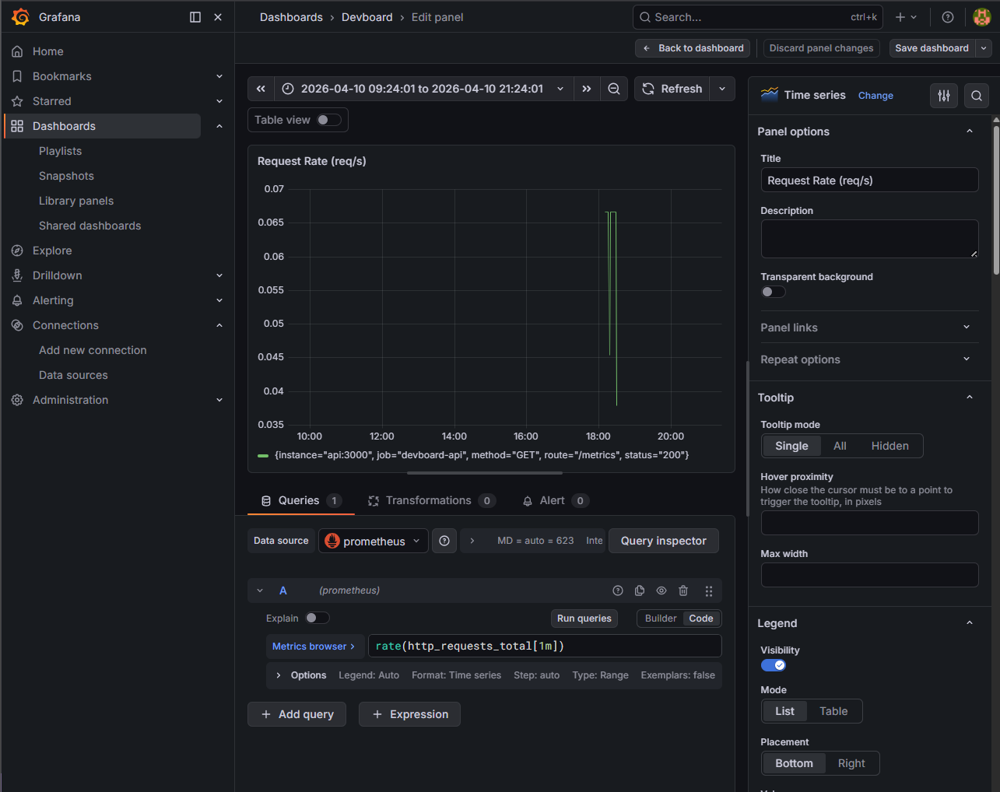

# 🚀 DevBoard — Full-Stack DevOps-Driven Task Management Platform

🔗 **Live Demo:** [https://devboard-rouge.vercel.app](https://devboard-rouge.vercel.app/)

## 📌 Overview

DevBoard is a production-grade, full-stack task and board management system designed to demonstrate **backend engineering, DevOps practices, and system design principles**.

The application itself is intentionally minimal — the primary focus is on:

* Scalable backend architecture
* Secure authentication & authorization
* CI/CD automation
* Containerization & orchestration
* Observability and monitoring

> **Key Idea:** The app is the product. The infrastructure is the real project.

---

## 🧠 Architecture

```
Frontend (React - Vercel)
        ↓
Backend API (Node.js - Railway)
        ↓
PostgreSQL (Railway Managed DB)
Redis (Rate Limiting + JWT Blocklist)
```

### DevOps Stack (Local / Advanced)

* Docker & Docker Compose
* Kubernetes (Minikube / k3s)
* Prometheus + Grafana (Observability)
* GitHub Actions (CI/CD)

---

## ⚙️ Tech Stack

| Layer      | Technology                 |
| ---------- | -------------------------- |
| Frontend   | React (Vite), Tailwind CSS |
| Backend    | Node.js (Express)          |
| Database   | PostgreSQL                 |
| Cache      | Redis                      |
| ORM        | Prisma                     |
| Auth       | JWT (HTTP-only cookies)    |
| DevOps     | Docker, Kubernetes         |
| CI/CD      | GitHub Actions             |
| Monitoring | Prometheus, Grafana        |
| Deployment | Vercel + Railway           |

---

## 🔐 Features

### Authentication & Security

* JWT-based authentication (HTTP-only cookies)
* Secure cross-origin cookie handling (`sameSite=None`, `secure`)
* Redis-based JWT blocklist (logout invalidation)
* Rate limiting (login protection)

---

### Boards & Tasks

* Multi-user boards with role-based access (ADMIN / MEMBER)
* Task management (TODO / IN_PROGRESS / DONE)
* Member invitation & removal
* Secure resource-level authorization

---

### DevOps & Infrastructure

* Multi-stage Docker builds (optimized images)
* Docker Compose for full local setup
* CI/CD pipeline with GitHub Actions
* Kubernetes deployment with:

  * Deployments & Services
  * Horizontal Pod Autoscaler (HPA)
  * Liveness & readiness probes

---

### Observability

* `/metrics` endpoint using `prom-client`
* Prometheus scraping
* Grafana dashboards:

  * Request rate
  * Error rate
  * P95 latency
  * Active connections

---

## 📂 Project Structure

```
devboard/
├── client/                 # React frontend
├── src/
│   ├── routes/
│   ├── middleware/
│   ├── lib/
│   └── index.js
├── prisma/
├── k8s/                   # Kubernetes manifests
├── .github/workflows/     # CI/CD pipelines
├── docker-compose.yml
├── Dockerfile
├── prometheus.yml
└── README.md
```

---

## 🚀 Getting Started (Local Development)

### 1. Clone the repository

```bash
git clone https://github.com/your-username/devboard.git
cd devboard
```

---

### 2. Setup environment variables

Create `.env`:

```env
DATABASE_URL=postgresql://user:password@db:5432/devboard
REDIS_URL=redis://redis:6379
JWT_SECRET=your-secret
JWT_EXPIRY=1d
```

---

### 3. Run backend + services

```bash
docker-compose up --build
```

---

### 4. Run frontend

```bash
cd client
npm install
npm run dev
```

---

### 5. Access

* Frontend → http://localhost:5173
* Backend → http://localhost:3000

---

## 🌐 Production Deployment

🔗 **Live URL:** [https://devboard-rouge.vercel.app](https://devboard-rouge.vercel.app/)

### Frontend

* Hosted on **Vercel**

### Backend

* Hosted on **Railway**

### Database

* Railway PostgreSQL

### Redis

* Railway / Upstash

---

## 🔄 CI/CD Pipeline

On every push to `main`:

1. Lint code
2. Run tests
3. Build Docker image
4. Tag image (`latest` + Git SHA)
5. Push to registry
6. Deploy to Kubernetes

---

## 📊 Observability

### Metrics Endpoint

```
GET /metrics
```

### Key Metrics

* `http_requests_total`
* `http_request_duration_seconds`
* `active_connections`

---

### Grafana Dashboard Includes:

* Request Rate
* Error Rate (5xx)
* P95 Latency
* Pod scaling (HPA)

### 📸 Observability Screenshots

#### Prometheus Metrics



#### Grafana Dashboard



---

## ⚖️ Key Engineering Decisions

### 1. Stateless Authentication

JWT used with Redis blocklist to enable secure logout.

### 2. Authorization-first Design

All resource access is validated at backend (zero trust on client).

### 3. Query-level Authorization

Access control enforced directly in DB queries to prevent data leakage.

### 4. Graceful Degradation

System continues functioning if Redis fails (reduced security, maintained availability).

### 5. Hybrid Deployment Strategy (AWS Attempt)

Due to resource constraints, stateful services were separated from Kubernetes — demonstrating practical system design tradeoffs.

---

## 🧠 Learnings & Highlights

* Built a full production-grade backend system from scratch
* Implemented secure cross-origin authentication
* Designed scalable infrastructure using Kubernetes
* Integrated observability with Prometheus & Grafana
* Solved real-world deployment issues (resource constraints, networking, cookies)

---

## 🏁 Future Improvements

* Custom domain + HTTPS enforcement
* Centralized logging (ELK / Loki)
* Request-based autoscaling (Prometheus metrics)
* Role-based permissions expansion
* Terraform-based infrastructure provisioning

---

## 💬 Interview Talking Points

* Multi-stage Docker builds for optimized images
* CI/CD pipeline with GitHub Actions
* Horizontal Pod Autoscaling based on CPU
* Redis usage for rate limiting and JWT invalidation
* Prometheus + Grafana observability setup
* Secure cookie-based auth across domains

---

## 👨‍💻 Author

**Saurabh Kumar Tiwari**
GitHub: https://github.com/saurabhkumargit

---

## ⭐ Final Note

> This project is not about features — it’s about building a **production-grade system** end-to-end.

---
